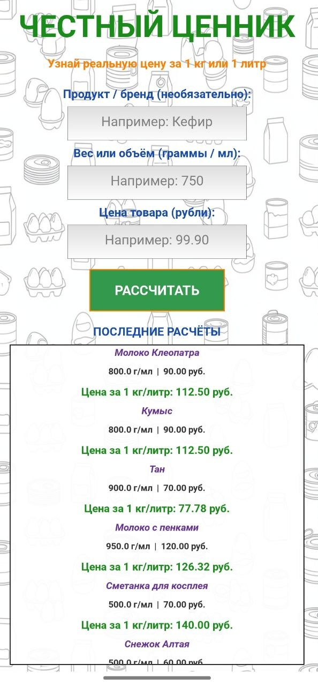

# Честный ценник

|  |

**Узнай реальную цену за 1 кг или 1 литр — никаких скрытых маркетинговых уловок.**

[](https://kivy.org)
[](https://developer.android.com)
[](LICENSE)

---

## О приложении


«Честный ценник» — это простое и удобное приложение для смартфонов, которое помогает быстро рассчитать реальную стоимость товара за 1 килограмм или 1 литр.

Вы когда-нибудь замечали, как сложно сравнивать цены на продукты, упакованные в фасовку разного веса или объёма? «Честный ценник» решает эту проблему одним нажатием кнопки.

### Возможности

- ✅ **Мгновенный расчёт** — введите вес/объём и цену, получите стоимость за 1 кг/литр
- ✅ **Необязательное поле «Продукт/бренд»** — добавляйте названия товаров, чтобы легче ориентироваться в истории
- ✅ **История расчётов** — последние 12 вычислений всегда под рукой
- ✅ **Интуитивный интерфейс** — всё на одном экране, ничего лишнего
- ✅ **Красивый дизайн** — приятные цвета, контрастные элементы, адаптация под разные экраны

---

## Скриншоты



---

## Установка

### Скачать APK

** [Скачать последнюю версию APK](https://github.com/Orochysensey/chestny-cennik/releases/latest)**

1. Скачайте файл `honestprice.apk`
2. Перенесите на телефон
3. Разрешите установку из неизвестных источников
4. Установите и пользуйтесь!

### Или соберите самостоятельно

```bash
git clone https://github.com/Orochysensey/chestny-cennik.git
cd chestny-cennik
buildozer android debug
